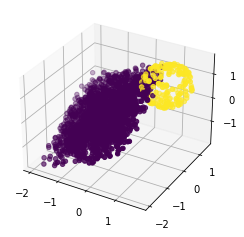
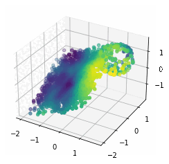

# Sphere Fitting with Neural Guided RANSAC

## About

This project is a demonstration of a simple sphere fitting algorithm using a neural network to guide the RANSAC algorithm. The algorithm is based on the [NG-RANSAC algorithm](https://arxiv.org/abs/1905.04132) and is used to find the best fitting sphere to a set of points.

<p align="center">
    
    
</p>
<p align="center">
    <em>Fig 1-2. On the left plot you can observe the ground truth shape, and on the right plot you can see the probability distribution that is learned by NN to guide inlier selection for sphere fitting.</em>
</p>

## Setup

Install all required dependencies:
```
pip install -r requirements.txt
```

Run the following command to train the model:
```
python main.py  [--gpu_num] [--num_epochs]

```

## Task

The task is to find the best fitting sphere to the given set of points.


## Method 

Neural Network learns a probability distribution over the points in the point cloud, and then probability distribution is used to guide the RANSAC algorithm.

## Dataset 

The dataset was synthesized. Each 3D PointCloud consists of a plane and a sphere. Inliers are considered to be the points of the sphere, and outliers are considered to be the points of the plane.

During **training** phase the inlier ratio is set to **0.3**, and during **testing** and **validation** phase the inlier ratio is set to **0.1**.

## Architecture

The Neual Network architecture is [PointNet](https://arxiv.org/abs/1612.00593), which is a general architecture for point cloud classification and segmentation.

## Experiments

The loss is a simple distance between ground truth and predicted sphere, computed as follows:
```
dist_i = (((a - x_i)^2 + (b - y_i)^2 + (c - z_i)^2)^(1/2) - r)^2
dist = ((dist_0 + ... + dist_N)/ N)^(1/2)
```    
Where **a**, **b**, **c** are the coordinates of the center of the predicted sphere, and **r** is the radius of the sphere. **x_i**, **y_i**, **z_i** are the coordinates of the ground truth sphere.


|                      | Train  | Val    | Test   |
|----------------------|--------|--------|--------|
| RANSAC               | 0.7172 | 0.7917 | 0.7802 |
| Neural Guided RANSAC | 0.0012 | 0.0064 | 0.0071 |